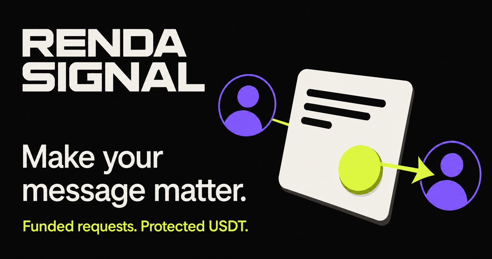
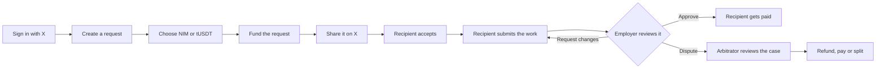
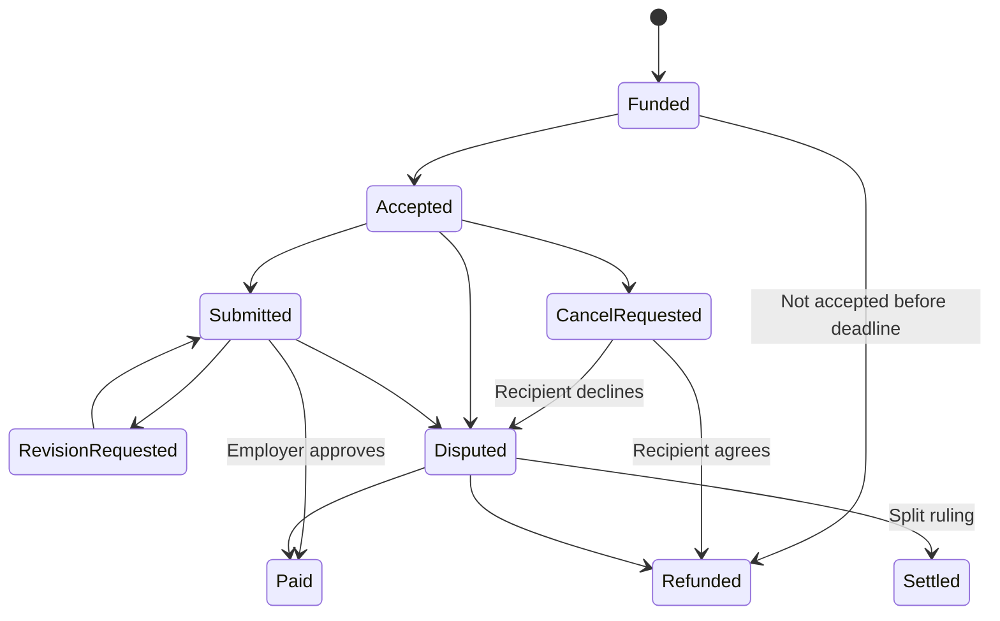
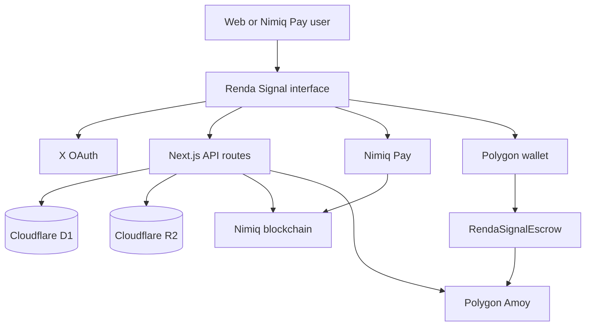

# Renda Signal

> Make your message matter.

Renda Signal lets you send a funded request to anyone on X. The request is public, the payment is visible, and the recipient gets paid when the work is done.

[](https://rendasignal.xyz)




## The problem

Cold messages are easy to ignore. There is no proof that the sender values your time, and no safe way to pay someone for completing a small request.

Renda Signal puts money behind the message. A sender can ask for a review, reply, introduction, feedback, test or other clear task. The recipient can see the funded offer before accepting it.

## How it works



## Two payment modes

### NIM mode

Made for quick, small requests using native NIM.

- Payment is made through Nimiq Pay.
- NIM is held in Renda Signal's managed account.
- Funding and payouts are checked on the Nimiq blockchain.
- The Renda admin account handles payouts, refunds and dispute rulings.

### Protected tUSDT mode

Made for testing the full smart-contract flow on Polygon Amoy.

- The sender locks test USDT in the escrow contract.
- Only the verified recipient wallet can accept and submit work.
- Approval releases the delivery reward.
- Cancellation needs both parties to agree.
- A dispute can end in a refund, payout or split.

> The Polygon mode uses test tokens with no real value.

## Request states



## What is already built

- X sign-in and identity checks
- Public funded requests aimed at an X handle
- Prepared X posts for sharing an offer
- Native NIM payments through Nimiq Pay
- Polygon Amoy tUSDT smart-contract escrow
- Attention fee and delivery reward
- Work submissions with messages and file attachments
- Employer approval and revision requests
- Mutual cancellation with a full employer refund
- Dispute chat for both parties and the arbitrator
- Refund, payout and split rulings
- Separate inbox, sent and history pages
- Mobile-friendly interface

## Build architecture



## Tech used

- Next.js, React and TypeScript
- Nimiq Mini App SDK and Nimiq Pay
- Solidity and viem
- Polygon Amoy
- Cloudflare D1 and R2
- X OAuth 2.0
- Vinext and Cloudflare Workers

## Run it locally

You need Node.js 22.13 or newer.

```bash
git clone https://github.com/Sheen223/Renda-Signal.git
cd Renda-Signal
npm install
copy .env.example .env.local
npm run dev
```

Add your X keys, session secret, Polygon contract addresses and RPC URL to `.env.local`.

## Useful commands

```bash
npm run dev
npm run lint
npm run build
npm test
npm run contracts:compile
```

## Safety

The Polygon build runs on the Amoy testnet. Its tUSDT and POL have no monetary value. The NIM flow uses a managed account, so it should only be used with small amounts during this beta.

## Links

- [Live app](https://rendasignal.xyz)
- [Source code](https://github.com/Sheen223/Renda-Signal)
- [Nimiq Mini Apps Competition](https://miniappscompetition.com/)

## License

Renda Signal is open source under the [MIT License](LICENSE).
